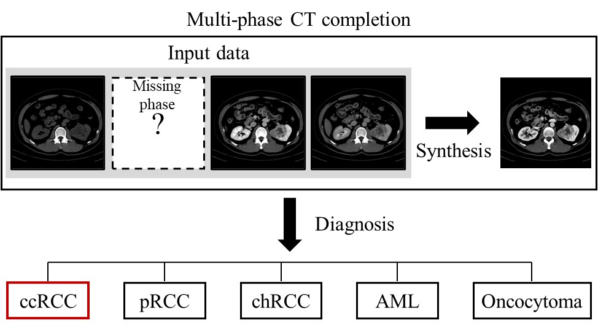
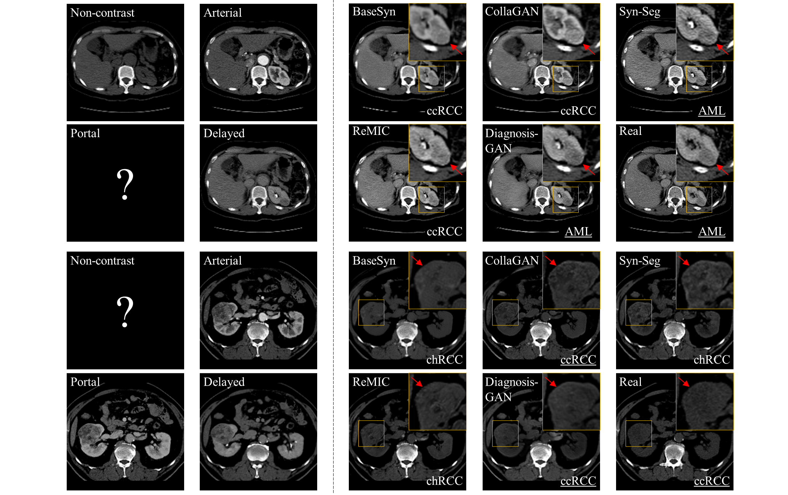

# DiagnosisGAN: A Unified Multi-Phase CT Synthesis and Classification Framework for Kidney Cancer Diagnosis With Incomplete Data 

Kwang-Hyun Uhm, Seung-Won Jung, Moon Hyung Choi, Sung-Hoo Hong, Sung-Jea Ko

Korea University, The Catholic University of Korea, Seoul

JBHI 2022.11
## Framework


## Framework



## Requirements
* Python >= 3.6
* Pytorch >= 1.2
* Ubuntu >= 16.04
* TITAN Xp

## Installation
```
git clone https://github.com/khuhm/DiagnosisGAN.git
cd DiagnosisGAN/
```

## Usage
```
python train_cls.py
python train_syn.py
```

## Citation
>K. -H. Uhm, S. -W. Jung, M. H. Choi, S. -H. Hong and S. -J. Ko, "A Unified Multi-Phase CT Synthesis and Classification Framework for Kidney Cancer Diagnosis With Incomplete Data," in *IEEE Journal of Biomedical and Health Informatics*, vol. **26,** no. **12,** pp. 6093-6104, Dec. 2022, doi: https://doi.org/10.1109/JBHI.2022.3219123.


